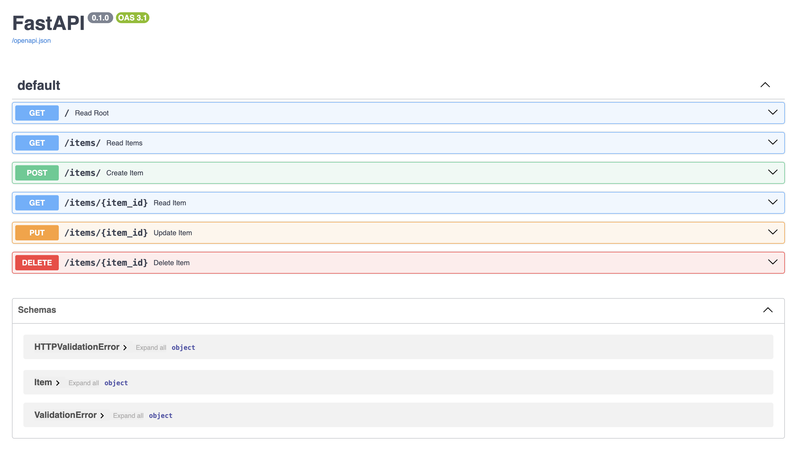

# FastAPI Application



## Instructions

* Install the dependencies

```bash
virtualenv -p python3 .env 
source .env/bin/activate
pip install -r -requirements.txt
```

* Start the API

```bash
uvicorn app:app --reload
```

* Read the Docs. Visit [http://127.0.0.1:8000/docs](http://127.0.0.1:8000/docs)
